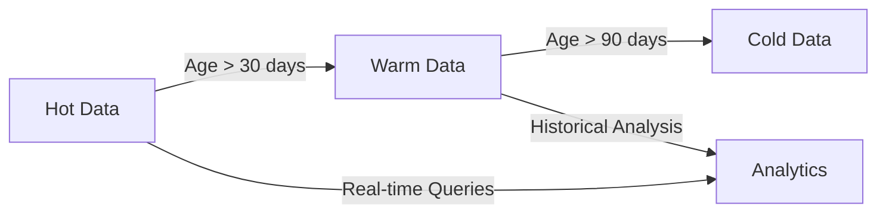

# Scalability Design Decisions

## Overview

This document outlines the key architectural decisions made to ensure the Neurodefender system can scale effectively to handle increasing workloads while maintaining performance and reliability. Each decision is documented with its context, rationale, and implications.

## Data Processing Architecture

### 1. Stream Processing Decision

**Context**: Need to process large volumes of security events and network traffic in real-time.

**Decision**: Adopt a hybrid stream and batch processing architecture using Apache Kafka and Spark Streaming.

**Rationale**:

- Real-time processing requirements for security events
- Need for both immediate analysis and historical data processing
- High throughput requirements (100K+ events per second)

**Implications**:

- Requires maintaining two processing pipelines
- Additional operational complexity
- Increased infrastructure costs
- Better flexibility in handling different workload types

### 2. Data Partitioning Strategy

**Context**: Need to distribute data across multiple nodes efficiently.

**Decision**: Implement customer-based sharding with consistent hashing.

**Rationale**:

- Natural isolation between customer data
- Improved data locality
- Better cache utilization
- Simplified compliance requirements

**Implications**:

- Need for rebalancing mechanism
- Cross-customer analytics are more complex
- Must maintain partition mapping metadata

## Compute Layer Architecture

### 1. Service Decomposition

**Context**: Need to scale different components independently.

**Decision**: Adopt microservices architecture with domain-driven boundaries.

**Rationale**:

- Independent scaling of components
- Better resource utilization
- Improved fault isolation
- Easier deployment and updates

**Components**:

```plaintext
Neurodefender/
├── SIEM/
│   ├── Event Collector
│   ├── Correlation Engine
│   └── Analytics Service
├── NGFW/
│   ├── Packet Processor
│   ├── Policy Engine
│   └── ML Inference
└── ML Platform/
    ├── Feature Store
    ├── Model Registry
    └── Training Pipeline
```

### 2. Containerization Strategy

**Context**: Need for consistent deployment and scaling across environments.

**Decision**: Use Kubernetes with custom resource definitions (CRDs) for orchestration.

**Rationale**:

- Automated scaling capabilities
- Resource optimization
- Environment consistency
- Rolling update support

**Implementation**:

```yaml
apiVersion: neurodefender.io/v1
kind: MLInference
metadata:
  name: threat-detection
spec:
  replicas: 3
  scaling:
    metrics:
      - type: QPS
        averageValue: 1000
    minReplicas: 2
    maxReplicas: 10
  resources:
    requests:
      memory: "4Gi"
      gpu: "1"
```

## Storage Architecture

### 1. Multi-tiered Storage

**Context**: Different data types have different access patterns and retention requirements.

**Decision**: Implement three-tiered storage architecture:

- Hot Tier: ClickHouse
- Warm Tier: Elasticsearch
- Cold Tier: Object Storage

**Rationale**:

- Cost optimization
- Performance optimization
- Compliance requirements
- Different query patterns

**Data Flow**:



### 2. Caching Strategy

**Context**: Need to reduce database load and improve response times.

**Decision**: Implement multi-level caching with Redis and local caches.

**Rationale**:

- Reduced database load
- Improved response times
- Support for distributed caching
- Better scalability

**Architecture**:

```plaintext
Client Request
└── L1: Local Cache (1s)
    └── L2: Redis Cache (60s)
        └── L3: Database
```

## Network Architecture

### 1. Load Balancing

**Context**: Need to distribute traffic across service instances.

**Decision**: Use Layer 7 load balancing with service mesh (Istio).

**Rationale**:

- Advanced traffic management
- Built-in service discovery
- Circuit breaking capabilities
- Advanced metrics and tracing

**Configuration**:

```yaml
apiVersion: networking.istio.io/v1alpha3
kind: VirtualService
metadata:
  name: ml-inference
spec:
  hosts:
  - ml-inference
  http:
  - route:
    - destination:
        host: ml-inference
        subset: v1
      weight: 90
    - destination:
        host: ml-inference
        subset: v2
      weight: 10
```

### 2. Regional Distribution

**Context**: Need to serve users across different geographical regions.

**Decision**: Implement multi-region deployment with data replication.

**Rationale**:

- Reduced latency
- Regional compliance
- Disaster recovery
- Better availability

**Architecture**:

```plaintext
Primary Region
├── Active Services
├── Primary Database
└── Sync Replication
    └── Secondary Region
        ├── Active Services
        ├── Secondary Database
        └── Async Replication
            └── DR Region
```

## Monitoring and Scaling Triggers

### 1. Metrics Collection

**Context**: Need to make informed scaling decisions.

**Decision**: Implement comprehensive metrics collection using Prometheus and custom metrics.

**Rationale**:

- Data-driven scaling decisions
- Performance optimization
- Capacity planning
- Cost optimization

**Key Metrics**:

- QPS (Queries Per Second)
- Latency percentiles (P50, P95, P99)
- Resource utilization
- Error rates
- Queue depths

### 2. Autoscaling Policies

**Context**: Need automated scaling based on workload.

**Decision**: Implement multi-dimensional autoscaling based on custom metrics.

**Rationale**:

- Automated resource optimization
- Predictive scaling capabilities
- Cost efficiency
- Better reliability

**Scaling Matrix**:

```yaml
scaling_policies:
  ml_inference:
    metrics:
      - name: qps
        threshold: 1000
        window: 60s
      - name: gpu_utilization
        threshold: 80
        window: 300s
    actions:
      min_replicas: 2
      max_replicas: 10
      scale_up_factor: 1.5
      scale_down_factor: 0.7
```

## Future Considerations

### 1. Planned Improvements

- Edge computing integration
- Serverless component adoption
- Enhanced predictive scaling
- Global data mesh implementation

### 2. Research Areas

- Adaptive scaling algorithms
- ML-based resource optimization
- Advanced data partitioning schemes
- Next-gen storage solutions

## Validation Metrics

### 1. Performance Targets

- Throughput: 100K+ events/second
- Latency: < 100ms P99
- Scale-up time: < 2 minutes
- Scale-down time: < 5 minutes

### 2. Scalability Testing

- Load testing methodology
- Chaos engineering practices
- Performance benchmarks
- Capacity planning models
