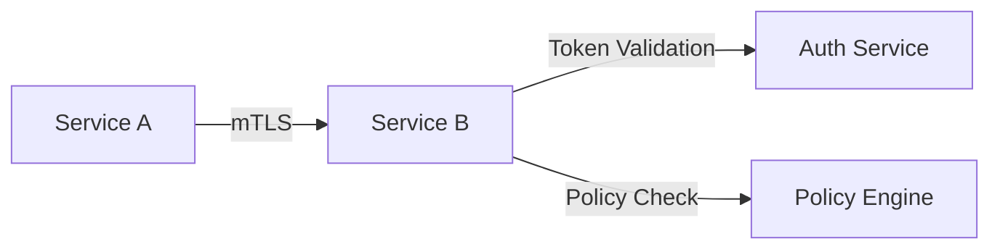
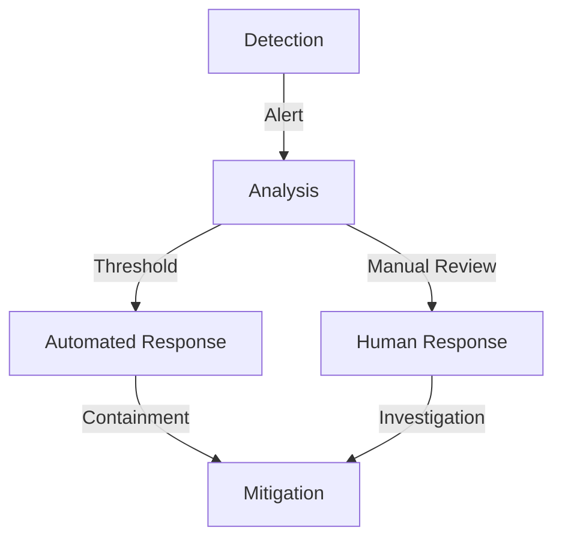

# Security Design Patterns

## Overview

This document outlines the fundamental security patterns implemented across the Neurodefender system. These patterns ensure a robust security posture while maintaining system performance and usability.

## Core Security Patterns

### 1. Zero Trust Architecture

#### 1.1 Implementation Strategy

**Pattern**: Never Trust, Always Verify

- Every request must be authenticated and authorized
- No implicit trust based on network location
- Continuous validation of security posture

**Components**:

```plaintext
Request Flow
├── Identity Verification
│   ├── Multi-factor Authentication
│   ├── Device Authentication
│   └── Context Validation
├── Policy Enforcement
│   ├── Fine-grained Access Control
│   ├── Just-in-Time Access
│   └── Session Management
└── Continuous Monitoring
    ├── Behavior Analysis
    ├── Risk Scoring
    └── Access Revocation
```

#### 1.2 Network Segmentation

- Micro-segmentation at service level
- Dynamic policy enforcement
- Network isolation zones

### 2. Defense in Depth

#### 2.1 Layer Security Model

```plaintext
Security Layers
├── Perimeter Security
│   ├── DDoS Protection
│   ├── WAF Rules
│   └── API Gateway
├── Network Security
│   ├── Microsegmentation
│   ├── Encryption
│   └── Traffic Monitoring
├── Application Security
│   ├── Input Validation
│   ├── Output Encoding
│   └── Session Management
└── Data Security
    ├── Encryption at Rest
    ├── Encryption in Transit
    └── Key Management
```

#### 2.2 Control Types

- Preventive Controls
- Detective Controls
- Responsive Controls
- Recovery Controls

### 3. Secure Data Handling

#### 3.1 Data Classification

**Levels**:

- Public
- Internal
- Confidential
- Restricted

**Handling Requirements**:

```yaml
restricted_data:
  encryption:
    at_rest: AES-256-GCM
    in_transit: TLS 1.3
  access_control:
    mfa_required: true
    audit_logging: full
    retention: 7 years
  backup:
    frequency: daily
    encryption: true
    geo_redundant: true
```

#### 3.2 Encryption Standards

- Transport: TLS 1.3
- Storage: AES-256-GCM
- Key Management: KMIP
- Hardware Security: HSM

### 4. Identity and Access Management

#### 4.1 Authentication Patterns

**Multi-layer Authentication**:

```plaintext
Authentication Flow
├── Primary Authentication
│   ├── Username/Password
│   └── Certificate-based
├── Secondary Authentication
│   ├── TOTP
│   ├── Hardware Token
│   └── Biometric
└── Context Validation
    ├── Device Trust
    ├── Location
    └── Behavior Pattern
```

#### 4.2 Authorization Patterns

- Role-Based Access Control (RBAC)
- Attribute-Based Access Control (ABAC)
- Just-In-Time Access
- Principle of Least Privilege

### 5. Secure Communication

#### 5.1 Service-to-Service Communication



#### 5.2 API Security

- Request Signing
- Rate Limiting
- Input Validation
- Output Sanitization

### 6. Threat Detection and Response

#### 6.1 Detection Patterns

**Multi-layer Detection**:

```yaml
detection_layers:
  network:
    - anomaly_detection
    - signature_based
    - behavioral_analysis
  application:
    - waf_rules
    - dependency_scanning
    - runtime_protection
  data:
    - access_patterns
    - data_leakage
    - encryption_validation
```

#### 6.2 Response Automation



### 7. Secure Development Lifecycle

#### 7.1 Security Gates

```plaintext
Development Pipeline
├── Planning
│   ├── Threat Modeling
│   └── Security Requirements
├── Development
│   ├── Secure Coding Standards
│   ├── Security Testing
│   └── Code Review
├── Testing
│   ├── SAST/DAST
│   ├── Penetration Testing
│   └── Vulnerability Scanning
└── Deployment
    ├── Security Validation
    ├── Configuration Review
    └── Compliance Check
```

#### 7.2 Continuous Security

- Automated Security Testing
- Dependency Scanning
- Configuration Management
- Compliance Monitoring

## Implementation Guidelines

### 1. Security Controls Matrix

```yaml
control_categories:
  authentication:
    required_strength: high
    mfa_required: true
    session_timeout: 1h
  encryption:
    algorithm: AES-256-GCM
    key_rotation: 30d
    hsm_required: true
  monitoring:
    log_retention: 1y
    alert_threshold: medium
    audit_frequency: continuous
```

### 2. Security Metrics

#### 2.1 Key Performance Indicators

- Mean Time to Detect (MTTD)
- Mean Time to Respond (MTTR)
- Security Coverage
- Risk Posture Score

#### 2.2 Compliance Metrics

- Policy Compliance Rate
- Control Effectiveness
- Audit Success Rate

## Future Enhancements

### 1. Planned Improvements

- Quantum-resistant cryptography
- Enhanced behavioral analytics
- Automated response capabilities
- Zero-knowledge proofs

### 2. Research Areas

- AI-driven threat detection
- Blockchain-based audit logs
- Homomorphic encryption
- Post-quantum cryptography

## Validation Requirements

### 1. Security Testing

- Penetration Testing
- Red Team Exercises
- Vulnerability Assessments
- Configuration Reviews

### 2. Compliance Validation

- Regular Audits
- Compliance Scanning
- Control Validation
- Policy Reviews
