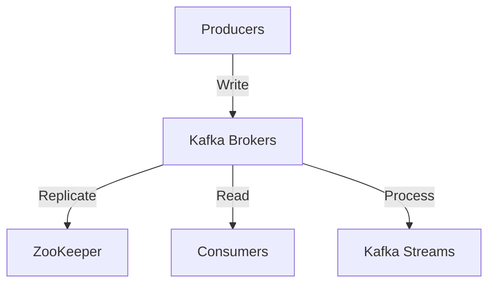

# Technology Choices and Rationale

## Overview

This document outlines the key technology decisions made for the Neurodefender system, including programming languages, frameworks, databases, and infrastructure components. Each choice is documented with its context, rationale, and trade-offs.

## Programming Languages

### 1. Rust (Core Security Components)

**Usage**: NGFW, Hardware Security, Runtime Security
**Rationale**:

- Zero-cost abstractions for high-performance networking
- Memory safety without garbage collection
- Strong concurrency guarantees
- Excellent FFI support for hardware integration

**Trade-offs**:

```yaml
advantages:
  - Superior performance
  - Memory safety
  - Thread safety
  - Modern tooling
disadvantages:
  - Steeper learning curve
  - Longer initial development time
  - Smaller ecosystem compared to other languages
```

### 2. Python (ML/AI Components)

**Usage**: ML Platform, Analytics Engine, Feature Processing
**Rationale**:

- Rich ecosystem for ML/AI (PyTorch, TensorFlow)
- Excellent data processing libraries
- Rapid prototyping capabilities
- Strong scientific computing support

**Dependencies**:

```yaml
core_frameworks:
  - PyTorch: "2.2.0"
  - TensorFlow: "2.15.0"
  - NumPy: "1.24.0"
  - Pandas: "2.1.0"
data_processing:
  - Apache Arrow: "14.0.1"
  - Dask: "2024.1.0"
ml_ops:
  - MLflow: "2.9.0"
  - Ray: "2.8.0"
```

### 3. Go (Infrastructure Components)

**Usage**: SIEM, Service Mesh, API Gateway
**Rationale**:

- Excellent concurrency model
- Strong standard library
- Great for network services
- Easy deployment

**Key Features**:

- Built-in concurrency primitives
- Cross-platform compilation
- Robust tooling
- Performance profiling

## Databases and Storage

### 1. Time-Series Data

**Choice**: ClickHouse
**Rationale**:

```yaml
requirements:
  - High-speed ingestion (>100K events/second)
  - Column-oriented storage
  - Real-time analytics
  - Efficient compression
features:
  ingestion_rate: "1M+ rows/second"
  compression_ratio: "7:1 average"
  query_performance: "sub-second for most analytics"
  storage_efficiency: "10x better than traditional RDBMS"
```

### 2. Search and Analytics

**Choice**: Elasticsearch
**Rationale**:

- Full-text search capabilities
- Real-time analytics
- Scalable distributed architecture
- Rich query language

**Configuration**:

```yaml
cluster_config:
  nodes:
    data: "minimum 3"
    master: "minimum 3"
    ingest: "minimum 2"
  sharding:
    number_of_shards: 5
    number_of_replicas: 1
  indexing:
    refresh_interval: "1s"
    translog_durability: "async"
```

### 3. Cache Layer

**Choice**: Redis
**Rationale**:

- In-memory performance
- Rich data structures
- Pub/sub capabilities
- Cluster support

**Use Cases**:

- Session storage
- Rate limiting
- Real-time analytics
- Feature flag management

## Infrastructure

### 1. Container Orchestration

**Choice**: Kubernetes
**Rationale**:

- Industry standard
- Rich ecosystem
- Declarative configuration
- Advanced scheduling

**Key Components**:

```yaml
core_services:
  - kube-apiserver
  - etcd
  - kubelet
extensions:
  service_mesh: "Istio"
  monitoring: "Prometheus + Grafana"
  logging: "Loki + FluentBit"
  tracing: "Jaeger"
```

### 2. Message Queue

**Choice**: Apache Kafka
**Rationale**:

- High throughput
- Durable storage
- Exactly-once semantics
- Stream processing capabilities

**Architecture**:



### 3. Service Mesh

**Choice**: Istio
**Rationale**:

- Traffic management
- Security features
- Observability
- Policy enforcement

**Features**:

```yaml
security:
  - mTLS
  - RBAC
  - Policy enforcement
traffic:
  - Load balancing
  - Circuit breaking
  - Fault injection
observability:
  - Distributed tracing
  - Metrics collection
  - Access logging
```

## Development Tools

### 1. CI/CD

**Choice**: GitLab CI
**Rationale**:

- Integrated with source control
- Container-native
- Pipeline as code
- Extensive plugin ecosystem

**Pipeline Structure**:

```yaml
stages:
  - build:
      - Code compilation
      - Container image creation
  - test:
      - Unit tests
      - Integration tests
      - Security scans
  - deploy:
      - Staging deployment
      - Production deployment
```

### 2. Monitoring and Observability

**Choice**: Prometheus + Grafana
**Rationale**:

- Time-series focused
- Pull-based architecture
- Rich query language
- Extensive visualization options

**Metrics Strategy**:

```yaml
metrics_types:
  - Counter: "Monotonic cumulative metrics"
  - Gauge: "Single numerical value metrics"
  - Histogram: "Distribution of values"
  - Summary: "Sample stream quantiles"
retention:
  prometheus: "15 days"
  long_term: "1 year in object storage"
```

## Security Tools

### 1. Identity Management

**Choice**: Keycloak
**Rationale**:

- Open-source
- Standard protocols support
- Extensible
- Federation capabilities

**Features**:

- OAuth 2.0/OpenID Connect
- SAML 2.0
- Social login
- MFA support

### 2. Secret Management

**Choice**: HashiCorp Vault
**Rationale**:

- Dynamic secrets
- Encryption as a service
- Access control
- Auto-rotation

**Use Cases**:

```yaml
secrets_management:
  - Database credentials
  - API keys
  - TLS certificates
  - Encryption keys
key_management:
  - Automatic rotation
  - Version control
  - Audit logging
```

## Future Technology Considerations

### 1. Emerging Technologies

- WebAssembly for edge computing
- QUIC for improved network performance
- eBPF for system observability
- Rust for more system components

### 2. Deprecation Plan

- Legacy protocol support
- Database migration paths
- API version lifecycle
- Component upgrade paths

## Evaluation Metrics

### 1. Technology Assessment Criteria

- Performance benchmarks
- Security assessments
- Community activity
- Enterprise support
- Total cost of ownership

### 2. Review Process

- Quarterly technology reviews
- Performance monitoring
- Security assessment
- Cost analysis
