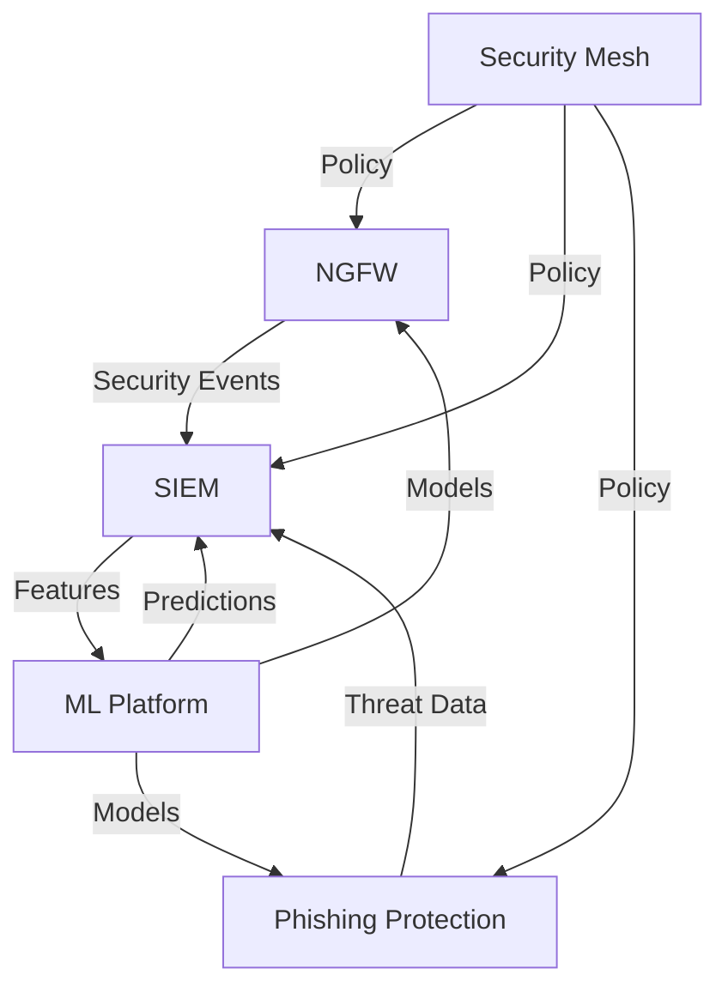

# Neurodefender System Architecture

## Overview

This document describes the high-level architecture of the Neurodefender system, an advanced Extended Detection and Response (XDR) platform integrating SIEM, NGFW, and Phishing Protection capabilities with deep learning-based analytics.

## Architectural Principles

### 1. Design Philosophies

- Zero Trust Security Model
- Defense in Depth
- Microservices Architecture
- Event-Driven Design
- AI-First Approach

### 2. Key Requirements

- Real-time threat detection and response
- Scalable data processing
- Multi-tenant isolation
- Compliance with security standards
- High availability and resilience

## System Components

### 1. Core Components



#### 1.1 NGFW (Next-Generation Firewall)

- Deep Packet Inspection
- ML-based Traffic Analysis
- Protocol Analysis
- Threat Prevention
- Policy Enforcement

#### 1.2 SIEM (Security Information and Event Management)

- Event Collection
- Real-time Correlation
- Threat Detection
- Compliance Reporting
- Security Analytics

#### 1.3 Phishing Protection

- Email Analysis
- URL Verification
- Attachment Scanning
- Behavioral Analysis
- Real-time Protection

#### 1.4 ML Platform

- Model Training
- Feature Engineering
- Real-time Inference
- Model Management
- Performance Monitoring

### 2. Supporting Infrastructure

#### 2.1 Data Pipeline

```plaintext
Event Flow
└── Collection Layer
    ├── Event Normalization
    ├── Enrichment
    └── Distribution Layer
        ├── Real-time Processing
        ├── Batch Processing
        └── Storage Layer
            ├── Hot Storage (ClickHouse)
            ├── Warm Storage (Elasticsearch)
            └── Cold Storage (Object Store)
```

#### 2.2 Service Mesh

- Service Discovery
- Load Balancing
- Circuit Breaking
- Encryption
- Access Control

## Component Integration

### 1. Communication Patterns

#### 1.1 Synchronous Communication

```yaml
rest_apis:
  - Security API Gateway
  - Management API
  - Monitoring API
grpc_services:
  - ML Inference
  - Policy Management
  - Health Checks
```

#### 1.2 Asynchronous Communication

```yaml
event_streams:
  - Security Events
  - Alerts
  - Audit Logs
message_queues:
  - Command Queue
  - Task Queue
  - Update Queue
```

### 2. Data Flow

#### 2.1 Real-time Path


#### 2.2 Batch Path


## Deployment Architecture

### 1. Physical Architecture

```plaintext
Infrastructure Layout
├── Edge Layer
│   ├── NGFW Appliances
│   └── Sensors
├── Processing Layer
│   ├── Event Processors
│   ├── ML Inference
│   └── Analytics Engine
└── Storage Layer
    ├── Time-Series DB
    ├── Search Cluster
    └── Object Storage
```

### 2. Logical Architecture

```yaml
environments:
  production:
    regions: ["us-east", "eu-west", "ap-southeast"]
    availability_zones: 3
    replication_factor: 2
  staging:
    regions: ["us-east"]
    availability_zones: 2
    replication_factor: 1
```

## Security Architecture

### 1. Security Layers

- Network Security
- Application Security
- Data Security
- Identity and Access Management

### 2. Security Controls

```plaintext
Control Framework
├── Prevention Controls
│   ├── Access Control
│   ├── Encryption
│   └── Input Validation
├── Detection Controls
│   ├── Threat Detection
│   ├── Anomaly Detection
│   └── Audit Logging
└── Response Controls
    ├── Incident Response
    ├── Auto-remediation
    └── Recovery Procedures
```

## Scalability and Performance

### 1. Scaling Strategies

- Horizontal Scaling
- Vertical Scaling
- Auto-scaling
- Load Distribution

### 2. Performance Targets

```yaml
performance_metrics:
  throughput:
    events_per_second: 100000
    packets_per_second: 1000000
  latency:
    processing_time: "<100ms"
    detection_time: "<1s"
  availability:
    uptime: "99.99%"
    recovery_time: "<30s"
```

## Monitoring and Observability

### 1. Monitoring Infrastructure

- Metrics Collection
- Log Aggregation
- Distributed Tracing
- Health Checking

### 2. Alerting and Response

```yaml
alert_categories:
  security:
    - Threat Detection
    - Policy Violation
    - Authentication Failure
  performance:
    - Resource Utilization
    - Latency Spikes
    - Error Rates
  availability:
    - Component Health
    - Service Degradation
    - Data Synchronization
```

## Future Architecture

### 1. Planned Enhancements

- Edge Computing Integration
- Zero-Trust Network Access
- Quantum-Safe Cryptography
- Advanced AI Capabilities

### 2. Research Areas

- Federated Learning
- Privacy-Preserving Analytics
- Automated Response Systems
- Behavioral Biometrics
