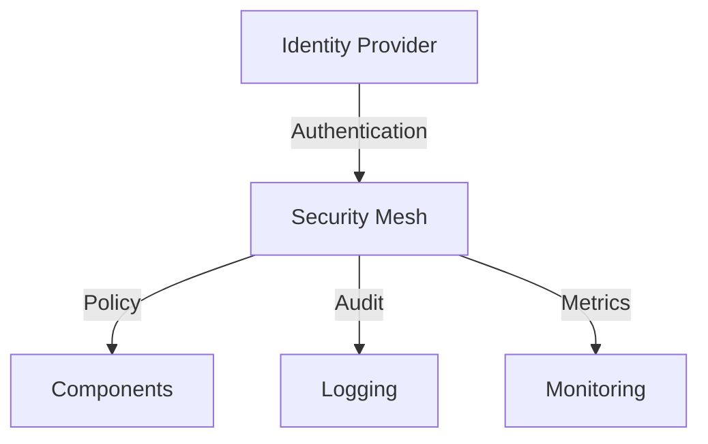

# System Components Overview

## Main Components

### 1. Security Information and Event Management (SIEM)

#### Core Responsibilities

- Real-time event collection and analysis
- Log aggregation and normalization
- Security incident detection
- Compliance reporting
- Threat intelligence integration

#### Subcomponents

```plaintext
SIEM Platform
├── Collection Engine
│   ├── Log Collectors
│   ├── Event Normalizers
│   └── Input Validators
├── Processing Engine
│   ├── Stream Processor
│   ├── Correlation Engine
│   └── Enrichment Service
├── Analytics Engine
│   ├── Query Engine
│   ├── Reporting Service
│   └── Visualization Tools
└── Storage Engine
    ├── Hot Storage (Real-time)
    ├── Warm Storage (Recent)
    └── Cold Storage (Archive)
```

### 2. Next-Generation Firewall (NGFW)

#### NGFW Core Responsibilities

- Network traffic inspection
- Threat prevention
- Application control
- SSL/TLS inspection
- Policy enforcement

#### NGFW Subcomponents

```plaintext
NGFW Platform
├── Packet Processing
│   ├── DPI Engine
│   ├── Protocol Analyzers
│   └── Traffic Classifiers
├── Security Services
│   ├── IPS Engine
│   ├── Anti-Malware
│   └── URL Filtering
├── Policy Engine
│   ├── Rule Processor
│   ├── Policy Manager
│   └── Access Controller
└── Management
    ├── Configuration
    ├── Monitoring
    └── Reporting
```

### 3. Machine Learning Platform

#### MLP Core Responsibilities

- Model training and deployment
- Feature engineering
- Real-time inference
- Model performance monitoring
- ML pipeline management

#### MLP Subcomponents

```plaintext
ML Platform
├── Feature Store
│   ├── Feature Extraction
│   ├── Feature Registry
│   └── Feature Serving
├── Training Pipeline
│   ├── Data Preparation
│   ├── Model Training
│   └── Validation Service
├── Model Registry
│   ├── Version Control
│   ├── Artifact Storage
│   └── Deployment Manager
└── Inference Engine
    ├── Real-time Inference
    ├── Batch Inference
    └── Performance Monitor
```

### 4. Phishing Protection

#### PP Core Responsibilities

- Email content analysis
- URL reputation checking
- Attachment scanning
- User behavior analysis
- Real-time protection

#### PP Subcomponents

```plaintext
Phishing Protection
├── Email Analysis
│   ├── Content Scanner
│   ├── Header Analyzer
│   └── Attachment Scanner
├── URL Defense
│   ├── URL Analyzer
│   ├── Reputation Check
│   └── Sandbox Analysis
├── User Protection
│   ├── Behavior Analysis
│   ├── Training Module
│   └── Reporting Tools
└── Response Engine
    ├── Block Actions
    ├── Quarantine
    └── Remediation
```

## Supporting Components

### 1. Security Mesh

#### SM Core Responsibilities

- Identity and access management
- Policy distribution
- Security orchestration
- Compliance enforcement

#### Architecture



### 2. Data Pipeline

#### DP Core Responsibilities

- Data collection and aggregation
- Stream processing
- Data transformation
- Storage management

#### Data Flow

```plaintext
Data Pipeline
├── Ingestion Layer
│   ├── Collectors
│   ├── Validators
│   └── Buffers
├── Processing Layer
│   ├── Stream Processors
│   ├── Batch Processors
│   └── ETL Jobs
├── Storage Layer
│   ├── Time Series DB
│   ├── Object Storage
│   └── Cache Layer
└── Query Layer
    ├── Query Engine
    ├── API Gateway
    └── Export Service
```

### 3. Monitoring and Observability

#### Core Responsibilities of Monitoring and Observability

- System health monitoring
- Performance metrics
- Distributed tracing
- Alert management

#### Components

```yaml
monitoring_stack:
  metrics:
    - Prometheus
    - Grafana
    - Custom Exporters
  logging:
    - Loki
    - FluentBit
    - Elasticsearch
  tracing:
    - Jaeger
    - OpenTelemetry
    - Trace Collectors
  alerting:
    - AlertManager
    - Notification Systems
    - Incident Response
```

## Integration Points

### 1. External Interfaces

#### API Gateway

- REST APIs
- GraphQL endpoints
- WebSocket connections
- gRPC services

#### Third-party Integration

```yaml
integration_types:
  security:
    - Threat Intel Feeds
    - Vulnerability Databases
    - Security Vendors
  cloud:
    - AWS Security Hub
    - Azure Sentinel
    - GCP Security Command
  compliance:
    - Audit Systems
    - Reporting Tools
    - Compliance Frameworks
```

### 2. Internal Communication

#### Message Bus

- Event streaming
- Command messages
- State updates
- Audit logs

#### Service Mesh

```plaintext
Service Mesh Features
├── Traffic Management
│   ├── Load Balancing
│   ├── Circuit Breaking
│   └── Rate Limiting
├── Security
│   ├── mTLS
│   ├── Authentication
│   └── Authorization
├── Observability
│   ├── Metrics
│   ├── Logging
│   └── Tracing
└── Policy Enforcement
    ├── Access Control
    ├── Quotas
    └── Configuration
```

## Deployment Considerations

### 1. Infrastructure Requirements

#### Compute Resources

```yaml
compute_requirements:
  ml_platform:
    cpu: "32 cores"
    memory: "128GB"
    gpu: "4x NVIDIA A100"
  ngfw:
    cpu: "64 cores"
    memory: "256GB"
    network: "100Gbps"
  siem:
    cpu: "48 cores"
    memory: "192GB"
    storage: "20TB"
```

#### Network Requirements

- High-bandwidth interconnects
- Low-latency paths
- Redundant connections
- Geographic distribution

### 2. High Availability

#### Redundancy

- Component redundancy
- Data replication
- Geographic failover
- Disaster recovery

#### Performance Targets

```yaml
availability_targets:
  uptime: "99.99%"
  recovery_time: "< 5 minutes"
  data_durability: "99.999999999%"
  backup_frequency: "continuous"
```

## Future Extensions

### 1. Planned Components

- Edge Computing Nodes
- Quantum-Safe Cryptography
- Advanced Analytics Engine
- Automated Response System

### 2. Integration Roadmap

- Enhanced Cloud Integration
- Additional Security Vendors
- Extended API Support
- Custom Plugins Platform
