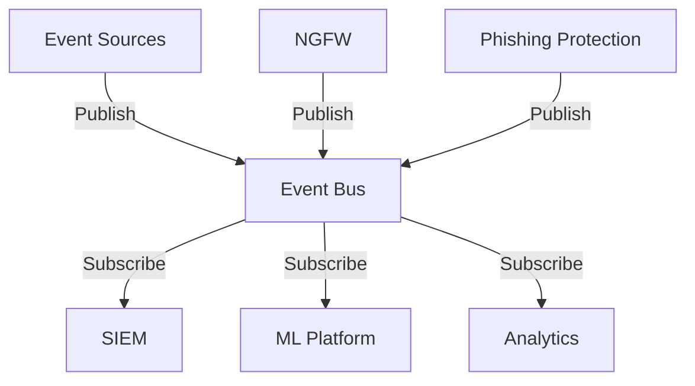
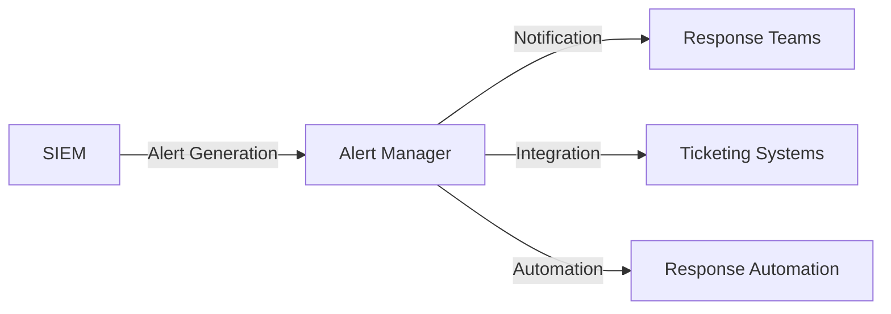
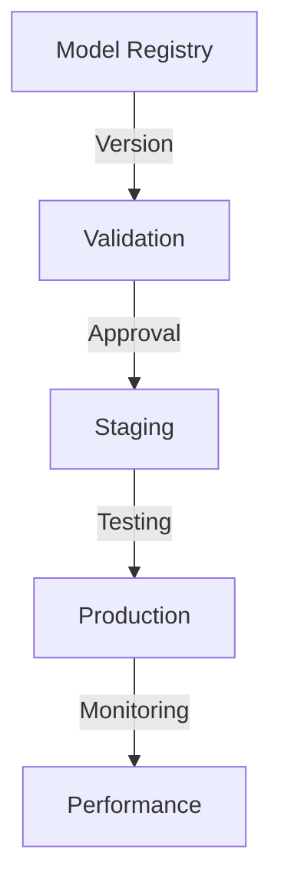

# System Integration Patterns

## Overview

This document outlines the integration patterns, protocols, and architectures used within the Neurodefender system for both internal component communication and external system integration. The integration framework ensures secure, reliable, and efficient data flow across all system boundaries.

## Internal Integration Patterns

### 1. Event-Driven Architecture



#### 1.1 Event Bus Configuration

```yaml
kafka_config:
  topics:
    security_events:
      partitions: 32
      replication: 3
      retention: "7d"
    alerts:
      partitions: 16
      replication: 3
      retention: "30d"
    metrics:
      partitions: 8
      replication: 2
      retention: "1d"
```

### 2. Service Mesh Integration

```plaintext
Service Communication
├── Service Discovery
│   ├── DNS Resolution
│   ├── Health Checks
│   └── Load Balancing
├── Traffic Management
│   ├── Circuit Breaking
│   ├── Retry Logic
│   └── Rate Limiting
├── Security
│   ├── mTLS
│   ├── Authorization
│   └── Authentication
└── Observability
    ├── Metrics
    ├── Tracing
    └── Logging
```

## Component Integration

### 1. SIEM Integration

#### 1.1 Data Collection

```yaml
collection_methods:
  syslog:
    protocol: "TCP/TLS"
    format: "RFC5424"
    ports: [6514, 6515]
  api:
    protocol: "HTTPS"
    auth: "OAuth2"
    format: "JSON"
  agents:
    types: ["Windows", "Linux", "Network"]
    protocols: ["MQTT", "HTTPS"]
```

#### 1.2 Alert Integration



### 2. NGFW Integration

#### 2.1 Traffic Analysis

```yaml
traffic_flow:
  inspection:
    inline_mode: true
    bypass_criteria:
      latency_threshold: "1ms"
      cpu_threshold: 80
  ml_integration:
    batch_size: 1000
    inference_timeout: "10ms"
    feature_extraction:
      window_size: "1s"
```

#### 2.2 Policy Distribution

```plaintext
Policy Framework
├── Global Policies
│   ├── Base Rules
│   └── Compliance Rules
├── Group Policies
│   ├── Department Rules
│   └── Role-based Rules
└── Local Policies
    ├── Instance-specific Rules
    └── Emergency Rules
```

### 3. ML Platform Integration

#### 3.1 Feature Distribution

```yaml
feature_pipeline:
  real_time:
    protocol: "gRPC"
    batch_size: 100
    timeout: "50ms"
  batch:
    protocol: "Kafka"
    window_size: "5m"
    format: "Parquet"
```

#### 3.2 Model Deployment



## External Integration

### 1. Third-party Integration

#### 1.1 Threat Intelligence

```yaml
threat_feeds:
  providers:
    - name: "VirusTotal"
      protocol: "REST"
      update_frequency: "15m"
    - name: "AlienVault"
      protocol: "STIX/TAXII"
      update_frequency: "1h"
    - name: "Custom Feeds"
      protocol: "HTTPS"
      update_frequency: "30m"
```

#### 1.2 Cloud Integration

```plaintext
Cloud Services
├── AWS
│   ├── SecurityHub
│   ├── GuardDuty
│   └── CloudWatch
├── Azure
│   ├── Sentinel
│   ├── Security Center
│   └── Monitor
└── GCP
    ├── Security Command
    ├── Cloud Armor
    └── Operations
```

### 2. API Integration

#### 2.1 REST APIs

```yaml
api_endpoints:
  security:
    base_path: "/api/v1/security"
    auth: "OAuth2"
    rate_limit: "1000/minute"
  management:
    base_path: "/api/v1/admin"
    auth: "JWT + RBAC"
    rate_limit: "100/minute"
```

#### 2.2 Streaming APIs

```plaintext
Streaming Services
├── WebSocket
│   ├── Event Streams
│   ├── Alert Notifications
│   └── Metrics Updates
├── gRPC
│   ├── Feature Streaming
│   ├── Model Inference
│   └── Log Streaming
└── Kafka Connect
    ├── External Sources
    ├── Data Lakes
    └── Analytics Platforms
```

## Integration Security

### 1. Authentication & Authorization

```yaml
security_controls:
  authentication:
    methods:
      - OAuth2
      - mTLS
      - API Keys
    token_lifetime: "1h"
    refresh_enabled: true
  authorization:
    rbac_enabled: true
    policy_engine: "OPA"
    audit_logging: true
```

### 2. Data Protection

```plaintext
Security Measures
├── Encryption
│   ├── TLS 1.3
│   ├── Field-level Encryption
│   └── Key Rotation
├── Access Control
│   ├── Identity-based
│   ├── Role-based
│   └── Attribute-based
└── Monitoring
    ├── Access Logs
    ├── Audit Trail
    └── Anomaly Detection
```

## Integration Monitoring

### 1. Health Monitoring

```yaml
health_checks:
  endpoints:
    frequency: "30s"
    timeout: "5s"
  dependencies:
    frequency: "1m"
    timeout: "10s"
  metrics:
    collection_interval: "15s"
    retention: "7d"
```

### 2. Performance Monitoring

```plaintext
Performance Metrics
├── Latency
│   ├── Request Timing
│   ├── Processing Time
│   └── End-to-end Latency
├── Throughput
│   ├── Requests/Second
│   ├── Events/Second
│   └── Data Transfer Rate
└── Resource Usage
    ├── CPU Utilization
    ├── Memory Usage
    └── Network Bandwidth
```

## Future Enhancements

### 1. Integration Roadmap

- GraphQL API Gateway
- Event-driven Microservices
- Serverless Integration
- Enhanced Cloud Integration

### 2. Automation Plans

- CI/CD Pipeline Integration
- Automated Compliance Checks
- Self-healing Systems
- Intelligent Routing
